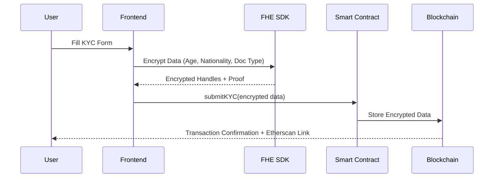

# IdentityChain

A privacy-preserving blockchain-based identity verification platform powered by Fully Homomorphic Encryption (FHE). Submit and verify KYC information while keeping sensitive data encrypted on-chain.

🌐 **Live Demo**: [https://identitychain.vercel.app](https://identitychain.vercel.app)

## 🎥 Demo Video

https://github.com/user-attachments/assets/demo_vedio.mp4

*Watch how IdentityChain enables secure KYC submission with FHE encryption*

## ✨ Features

- 🔐 **FHE Encryption**: Client-side encryption of sensitive KYC data using Zama's fhEVM
- 🔗 **On-Chain Privacy**: Age, nationality, and document type stored encrypted on Ethereum
- ✅ **Verifiable Without Decryption**: Perform age checks and verifications on encrypted data
- 👛 **Multi-Wallet Support**: Connect with MetaMask, Coinbase Wallet, WalletConnect
- 📱 **Real-Time Notifications**: Toast notifications with Etherscan transaction links
- 🎨 **Modern UI**: Clean, responsive interface built with shadcn/ui

## 🛠️ Technology Stack

| Layer | Technology |
|-------|-----------|
| **Frontend** | React 18 + TypeScript + Vite |
| **Smart Contracts** | Solidity 0.8.24 + Zama fhEVM v0.5.0 |
| **Encryption** | Fully Homomorphic Encryption (FHE) |
| **Web3 Integration** | Wagmi v2 + Viem |
| **Blockchain** | Ethereum Sepolia Testnet |
| **UI Components** | Tailwind CSS + shadcn/ui + Sonner |
| **Deployment** | Vercel |

## Getting Started

### Prerequisites

- Node.js 20.x or higher
- MetaMask or compatible Web3 wallet
- Sepolia testnet ETH for deployment

### Installation

```bash
# Install dependencies
npm install

# Copy environment template
cp .env.example .env

# Add your private key to .env
# PRIVATE_KEY=your_private_key_here
```

### Smart Contract Deployment

```bash
# Compile contracts
npm run compile

# Deploy to Sepolia testnet
npm run deploy
```

The deployment script will automatically:
- Deploy the PrivacyKYC contract
- Update `.env` with the contract address
- Update `KYCForm.tsx` with the contract address
- Save deployment info to `deployments/` folder

### Running the Frontend

```bash
# Start development server
npm run dev

# Build for production
npm run build
```

## Project Structure

```
IdentityChain/
├── contracts/
│   └── PrivacyKYC.sol        # FHE-enabled KYC contract
├── scripts/
│   └── deploy.cjs            # Deployment script
├── src/
│   ├── components/
│   │   └── KYCForm.tsx       # Main KYC submission form
│   ├── lib/
│   │   └── fhe.ts            # FHE encryption utilities
│   └── config/
│       └── wagmi.ts          # Web3 configuration
├── hardhat.config.cjs        # Hardhat configuration
└── .env                      # Environment variables
```

## 🔄 How It Works



### Process Flow

1. **🔐 Client-Side Encryption**: User's sensitive data (age, nationality, document type) is encrypted using FHE SDK before leaving the browser
2. **📤 Secure Submission**: Encrypted handles and zero-knowledge proofs are sent to the smart contract
3. **⛓️ On-Chain Storage**: Smart contract stores encrypted data permanently on Ethereum Sepolia
4. **✅ Privacy-Preserving Verification**: Admins can verify KYC status and perform age checks without decrypting raw data
5. **🔔 Real-Time Updates**: Users receive toast notifications with transaction status and Etherscan links

## 📜 Smart Contract Functions

### User Functions
```solidity
function submitKYC(
    externalEuint32 encryptedAge,
    externalEuint8 encryptedNationality,
    externalEuint8 encryptedDocType,
    bytes calldata inputProof
) external
```
Submit encrypted KYC information with FHE proof

```solidity
function getKYCData(address user) external view returns (
    euint32 age,
    euint8 nationality,
    euint8 documentType,
    ebool isVerified,
    uint256 submissionTime
)
```
Retrieve encrypted KYC data (encrypted values remain encrypted)

### Admin Functions
```solidity
function verifyKYC(address user, bool verified) external onlyAdmin
```
Verify user's KYC status (admin only)

```solidity
function isAgeAbove(address user, uint32 minAge) external returns (ebool)
```
Check if user meets minimum age requirement using FHE comparison (no decryption needed)

## 🔒 Security Features

- **🛡️ End-to-End Encryption**: Data encrypted in browser using Zama FHE SDK before transmission
- **🔑 Zero-Knowledge Proofs**: Input proofs verify encrypted data validity without revealing content
- **👮 Access Control**: Smart contract enforces role-based permissions (admin vs user)
- **📝 Immutable Records**: Blockchain provides tamper-proof audit trail
- **🎯 Selective Disclosure**: Only authorized parties can decrypt specific fields
- **⚡ Sepolia Testnet**: Safe testing environment before mainnet deployment

### Contract Address
- **Sepolia Testnet**: [`0x53834c87D409CAb6E0668e297d8bfF67C1d259DF`](https://sepolia.etherscan.io/address/0x53834c87D409CAb6E0668e297d8bfF67C1d259DF)

## 📝 Environment Variables

```env
# Blockchain Configuration
SEPOLIA_RPC_URL=https://ethereum-sepolia-rpc.publicnode.com
PRIVATE_KEY=your_private_key_here

# Frontend Configuration (auto-updated by deployment script)
VITE_KYC_CONTRACT_ADDRESS=0x53834c87D409CAb6E0668e297d8bfF67C1d259DF
```

## 🚀 Deployment

The project is deployed on Vercel with automatic SPA routing configuration:

```bash
# Deploy to Vercel
vercel --prod

# The vercel.json file ensures proper routing for all pages
```

**Live Production URL**: https://identitychain.vercel.app

## 🤝 Contributing

Contributions are welcome! Please feel free to submit a Pull Request.

## 📄 License

MIT License - see LICENSE file for details

## 🙋 Support

- **Issues**: [GitHub Issues](https://github.com/your-repo/IdentityChain/issues)
- **Zama Documentation**: [Zama fhEVM Docs](https://docs.zama.ai/fhevm)
- **Ethereum Sepolia Faucet**: [Get Testnet ETH](https://sepoliafaucet.com/)

## 🌟 Acknowledgments

Built with [Zama fhEVM](https://www.zama.ai/) - Bringing Fully Homomorphic Encryption to Ethereum

---

**⚠️ Note**: This is a testnet deployment for demonstration purposes. Do not submit real personal information.
